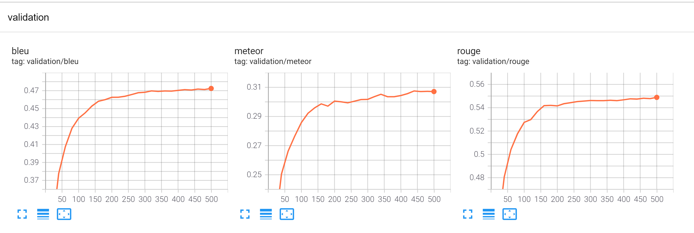
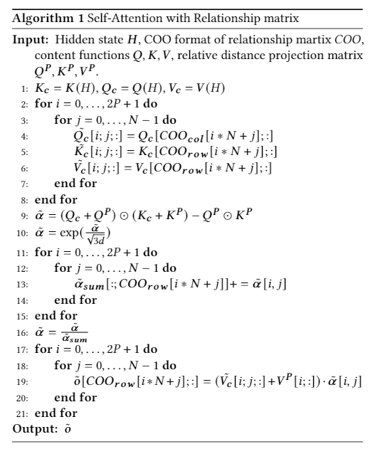

# ast_trans_icse
This is the implementation for AST-Trans: Code Summarization with Efficient Tree-Structured Attention.
## 1. install environments
 1. pip install -r requirements.

 2. we use pytorch-geometric to implement GNN models. pytorch-geometric can be installed by 
    
    pip install torch-scatter torch-sparse torch-cluster torch-spline-conv torch-geometric -f https://pytorch-geometric.com/whl/torch-1.9.0+cu102.html

## 2.pre process data
this step attends to generate pot, sbt, paths and relationship matrices of ASTs.
The [dataset](https://drive.google.com/drive/folders/1dc42GFE6nx4x5_2_6H-qelTSI1KmPEJe) we proposed have been pre-processed. If you want to pre-process the dataset of your own, you can save ASTs as a json object of format like {'type':'';'value':'','children':[]}, and then run:

python pre_process/process.py --data_dir your_data_set_path --max_ast_len 250 --process --make_vocab

## 3. run
we use py_config_runner.
The config of model is saved at ./config.
you need to change 'data_dir' to your own data set path.
clearml is also supported in our implementation.
if you do not want to use it, just set:

use_clearml = False

For run AST-Trans:

single-gpu:

python main.py --config ./config/ast_trans.py --g 0

multi-gpu:

python -u -m torch.distributed.launch --nproc_per_node=2 --use_env main.py --config=./config/ast_trans.py --g 0,1

you can change the config file to code_trans.py, gnn_trans.py, path_trans.py to run code_trans, gnn_trans or path_trans similarly.

## 4. test
For test, you can set the parameter 'is_test' to True.
and set the checkpoint file path.
The program will default find the checkpoint based on the hype-parameters.
And we apply a trained AST-Trans checkpoint file in ./checkpoint.
If you want to load model on your specific path, just change the 'load_epoch_path' of the test function in script/train.py 

load_epoch_path = './checkpoint/'

The prediction results are shown in [experiment_results](./experiment_results).

## 5. Algorithm
The specific implementation of GDC is implemented in /module/attn/fast_attn.py.
And for understanding, we show the algorithm of it as below.

